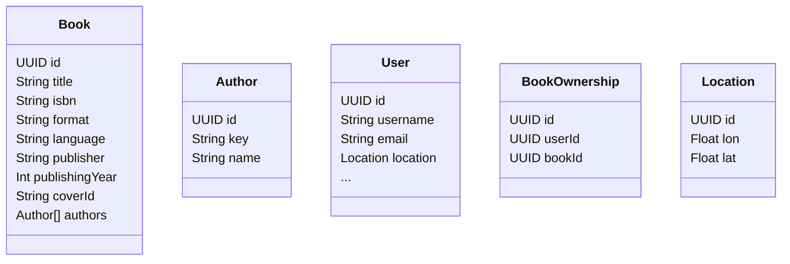

# Domain Analysis Daigram

### Import notes:
- book, author entity is _derived_ from ISBN API response
    - https://openlibrary.org/dev/docs/api/search
    - Example Request: https://openlibrary.org/search.json?isbn=9781611748864
    - Example Response [example.json](./example_response_isbn_api.json)

### ToDo
- [ ] Add missing classes
    - [x] Book
    - [x] Author
    - [x] User
    - [x] BookOwnership
    - [x] Location
    - [ ] Lending
    - [ ] 
- [ ] Add Connections

## Diagram

---

### Explainations
- book coverId -> can used to get cover image -> example https://covers.openlibrary.org/b/olid/OL51694024M-L.jpg
- Location -> WGS84 https://epsg.io/4326
